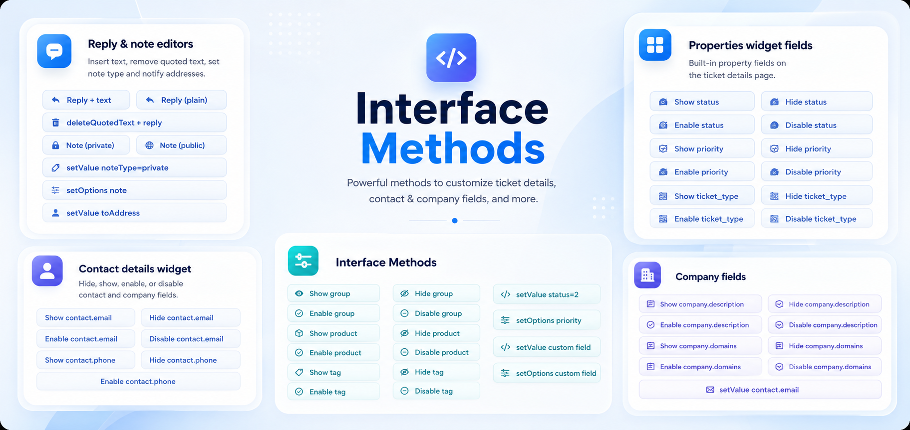

# Interface Methods Showcase



Generic Freshworks Platform 3.0 sample app that demonstrates every [`client.interface.trigger`](https://developers.freshworks.com/docs/app-sdk/v3.0/support_ticket/front-end-apps/interface-methods/) action documented for the Freshdesk **support_ticket** module.

Each surface exposes only the methods that work from that placement. Shared wrappers live in `app/scripts/interface-kit.js`; UI catalogs are built per placement in `sidebar.js`, `full_page.js`, `conversation_editor.js`, and `time_entry.js`.

---

## Quick start

```bash
npm install
fdk run
```

Install the app on a Freshdesk account, then open the surfaces below.

### Surfaces

| Placement | File | Purpose |
|-----------|------|---------|
| `full_page_app` | `full_page.html` | Common methods only (modals, dialogs, confirm, notify, navigation) |
| `ticket_sidebar` | `sidebar.html` | Full ticket-page catalog (chrome, properties, conversation, contact fields) |
| `ticket_conversation_editor` | `conversation_editor.html` | Editor field and `setValue` on open editor |
| `time_entry_background` | `time_entry.html` | Background host for Log time window field actions |
| `cti_global_sidebar` | `cti_sidebar.html` | Softphone and missed-call show/hide |

### Scenarios

1. **Full-page catalog** — Open the app from left navigation for modals, dialogs, confirm, notify, and opening ticket/contact pages.
2. **Ticket sidebar** — On any ticket, use the sidebar (resized to 700px) for ticket chrome, PROPERTIES, reply/note actions, timer, and contact/company fields.
3. **Editor and time-entry** — Install conversation editor and time entry background placements. Open a reply/note or the Log time window, then use the matching surface.
4. **CTI dialer** — From CTI global sidebar, show or hide the softphone iframe and missed-call badge.

### Configuration

Optional installation parameters (`config/iparams.json`):

| Iparam | Purpose |
|--------|---------|
| `demo_ticket_id` | Target ticket for **Open ticket** navigation |
| `demo_contact_id` | Target contact for **Open contact** navigation |
| `custom_field_name` | API name for custom PROPERTIES field demos (e.g. `cf_order_number`) |

---

## Project structure

```
app/
  full_page.html              # Common methods (modals, notify, navigation)
  sidebar.html                # Ticket-page catalog (collapsible panels)
  conversation_editor.html    # Editor field actions
  time_entry.html             # Log time window field actions
  cti_sidebar.html            # CTI softphone / missed-call
  scripts/
    interface-kit.js          # All client.interface.trigger wrappers
    page-init.js              # app.initialized() → InterfaceKit.setClient()
    catalog-helpers.js        # Shared HTML builders (buttons, accordions, groups)
    full_page.js              # Full-page catalog
    sidebar.js                # Ticket sidebar catalog
    conversation_editor.js
    time_entry.js
  views/
    modal.html                # showModal template (includes {{{appclient}}})
    dialog.html               # showDialog template
config/iparams.json
```

---

## How the app initializes

Every HTML surface loads `interface-kit.js` and `page-init.js`. Initialization stores the client on `InterfaceKit` and broadcasts a custom event so placement scripts can render their catalog.

```javascript
// app/scripts/page-init.js
app.initialized().then(function (client) {
  InterfaceKit.setClient(client);
  document.dispatchEvent(new CustomEvent('interface-kit:ready', { detail: { client: client } }));
});
```

All interface calls go through `InterfaceKit`, which wraps `client.interface.trigger` and surfaces success/failure via `showNotify`:

```javascript
// app/scripts/interface-kit.js
async function run(label, fn) {
  try {
    const result = await fn();
    await feedback(label, true);
    return result;
  } catch (error) {
    await feedback(label, false, error.message);
    throw error;
  }
}

function toggle(action, id) {
  return run(action + ' ' + id, function () {
    return getClient().interface.trigger(action, { id: id });
  });
}
```

---

## App surfaces and method coverage

| Placement | File | Interface methods demonstrated |
|-----------|------|--------------------------------|
| `full_page_app` | `full_page.html` | `showModal`, `showDialog`, `showConfirm`, `showNotify`, `click` (ticket/contact) |
| `ticket_sidebar` | `sidebar.html` | All ticket-page methods below (collapsible panels, 700px height) |
| `ticket_conversation_editor` | `conversation_editor.html` | Editor fields + `setValue` on open editor |
| `time_entry_background` | `time_entry.html` | Log time window fields |
| `cti_global_sidebar` | `cti_sidebar.html` | `show`/`hide` softphone and missed-call badge |

---

## Common interface methods

Available from **any placement**, including `full_page_app` and `ticket_sidebar`.

### showModal

Displays a modal in an iframe. Events and interface methods are **not** supported inside the modal; data methods, iparams, and request templates are.

The modal template must include `{{{appclient}}}`:

```html
<!-- app/views/modal.html -->
<script src="{{{appclient}}}"></script>
```

**With backdrop** (default):

```javascript
client.interface.trigger('showModal', {
  title: 'Sample modal (backdrop)',
  template: './views/modal.html',
  backdrop: true
});
```

App wrapper:

```javascript
InterfaceKit.modalWithBackdrop();
```

**Without backdrop** (beta; supported on `ticket_sidebar`, `ticket_requester_info`, `ticket_top_navigation`):

```javascript
client.interface.trigger('showModal', {
  title: 'Modal (no backdrop)',
  template: './views/modal.html',
  noBackdrop: true,
  linkText: 'Docs',
  linkUrl: 'https://developers.freshworks.com/docs/app-sdk/v3.0/support_ticket/front-end-apps/interface-methods/'
});
```

App wrapper: `InterfaceKit.modalNoBackdrop()`

| Attribute | Required | Notes |
|-----------|----------|-------|
| `template` | Yes | Path to modal HTML |
| `title` | No | Max 30 characters |
| `backdrop` | No | `true` for backdrop modal |
| `noBackdrop` | No | `true` for no-backdrop modal |
| `linkText`, `linkUrl` | No | Linked text in no-backdrop modal |

---

### showDialog

Displays a dialog box in an iframe. Same restrictions as modals for events/interface methods inside the dialog.

```javascript
client.interface.trigger('showDialog', {
  title: 'Sample dialog',
  template: './views/dialog.html'
});
```

App wrapper: `InterfaceKit.dialogDefault()`

---

### showConfirm

Displays a confirmation box with Save/Cancel (customizable labels). Returns `"Save"` or `"Cancel"`. Timeout: 10 seconds.

**Default labels:**

```javascript
const result = await client.interface.trigger('showConfirm', {
  title: 'Confirm action',
  message: 'Save the current demo settings?'
});
```

**Custom labels:**

```javascript
const result = await client.interface.trigger('showConfirm', {
  title: 'Custom labels',
  message: 'Proceed with the interface demo?',
  saveLabel: 'Proceed',
  cancelLabel: 'Back'
});
```

App wrappers: `InterfaceKit.confirmDefault()`, `InterfaceKit.confirmCustomLabels()`

| Attribute | Required | Max length |
|-----------|----------|------------|
| `message` | Yes | 100 |
| `title` | No | 30 |
| `saveLabel`, `cancelLabel` | No | 11 each |

---

### showNotify

Displays a toast notification.

```javascript
await client.interface.trigger('showNotify', {
  type: 'info',       // info | success | warning | danger | alert
  title: 'Notice',
  message: 'Sample notification.'
});
```

App wrapper: `InterfaceKit.showNotify(type, title, message)`  
Full-page demo cycles all five types: `InterfaceKit.notifyAllTypes()`

| Attribute | Required | Max length |
|-----------|----------|------------|
| `type` | Yes | One of five values above |
| `message` | Yes | 100 |
| `title` | No | 30 |

---

### click — open ticket or contact page

```javascript
// Open ticket details
await client.interface.trigger('click', { id: 'ticket', value: 42 });

// Open contact details
await client.interface.trigger('click', { id: 'contact', value: 7 });
```

App wrappers (reads IDs from iparams):

```javascript
const ids = await InterfaceKit.getDemoIds();
InterfaceKit.openTicket(ids.ticketId);
InterfaceKit.openContact(ids.contactId);
```

---

## CTI interface methods

**Placement:** `cti_global_sidebar` only (`app/cti_sidebar.html`)

### show / hide — softphone dialer

```javascript
await client.interface.trigger('show', { id: 'softphone' });
await client.interface.trigger('hide', { id: 'softphone' });
```

App wrappers: `InterfaceKit.showSoftphone()`, `InterfaceKit.hideSoftphone()`

### show / hide — missed-call badge

```javascript
await client.interface.trigger('show', { id: 'missedCall' });
await client.interface.trigger('hide', { id: 'missedCall' });
```

App wrappers: `InterfaceKit.showMissedCall()`, `InterfaceKit.hideMissedCall()`

---

## Ticket details page methods

**Placement:** `ticket_sidebar` (`app/sidebar.html`)

The sidebar renders collapsible `<details>` panels grouped by UI location. Each element has its own button group with **Show**, **Hide**, and (where supported) **Enable**, **Disable**.

### show / hide / enable / disable — ticket chrome

```javascript
await client.interface.trigger('show',   { id: 'attachments' });
await client.interface.trigger('hide',   { id: 'attachments' });
await client.interface.trigger('enable', { id: 'ticketEdit' });
await client.interface.trigger('disable', { id: 'reply' });
```

| Element ID | Show/hide | Enable/disable |
|------------|-----------|----------------|
| `attachments` | Yes | No |
| `attachmentsDelete` | Yes | No |
| `ticketSpam` | Yes | No |
| `ticketEdit` | Yes | Yes |
| `ticketDelete` | Yes | No |
| `ticketDueBy` | Yes | No |
| `reply` | Yes | Yes |
| `note` | Yes | Yes |
| `forward` | Yes | Yes |
| `noteEdit` | Yes | No |

App wrapper for all four actions:

```javascript
InterfaceKit.toggle('show', 'attachments');
InterfaceKit.toggle('hide', 'ticketSpam');
InterfaceKit.toggle('enable', 'reply');
InterfaceKit.toggle('disable', 'forward');
```

---

### click — expand conversation thread

Expands collapsed replies/notes in a long ticket thread.

```javascript
await client.interface.trigger('click', { id: 'expandConversation' });
```

App wrapper: `InterfaceKit.expandConversation()`

---

### start / stop — timer

```javascript
await client.interface.trigger('start', {
  id: 'timer',
  value: {
    agent: 99,
    billable: true,
    note: 'Timer started from interface method demo.'
  }
});

await client.interface.trigger('stop', { id: 'timer' });
```

App implementation reads the logged-in agent automatically:

```javascript
const agentId = await InterfaceKit.getLoggedInAgentId();
InterfaceKit.startTimer({ agent: agentId, billable: true, note: 'Started from sidebar demo.' });
InterfaceKit.stopTimer();
```

---

## Editor window methods

**Placement:** `ticket_sidebar` (open editor actions) and `ticket_conversation_editor` (field + open-editor `setValue`)

### click — reply with inserted text

```javascript
await client.interface.trigger('click', {
  id: 'reply',
  text: 'Sample reply text inserted by interface method.'
});
```

App wrapper: `InterfaceKit.replyWithText()`

Plain reply (no prefilled text): `InterfaceKit.replyPlain()`

---

### click — reply without quoted text

```javascript
await client.interface.trigger('click', { id: 'deleteQuotedText' });
await client.interface.trigger('click', { id: 'reply' });
```

App wrapper: `InterfaceKit.deleteQuotedTextThenReply()`

---

### click — note with inserted text

```javascript
await client.interface.trigger('click', {
  id: 'note',
  text: 'Sample note inserted by interface method.',
  isPublic: false
});
```

App wrappers: `InterfaceKit.noteWithText(false)`, `InterfaceKit.noteWithText(true)`

---

### setValue — note type

```javascript
await client.interface.trigger('setValue', {
  id: 'noteType',
  value: 'private'
});
```

App wrapper: `InterfaceKit.setNoteType('private')`

---

### setOptions — note type dropdown

```javascript
await client.interface.trigger('setOptions', {
  id: 'note',
  value: ['private']
});
```

App wrapper: `InterfaceKit.setNoteTypeOptions(['private'])`

---

### setValue — note notify-to addresses

```javascript
await client.interface.trigger('setValue', { id: 'note', toAddress: 'agent@example.com' });
await client.interface.trigger('setValue', { id: 'note', toAddress: 'a@example.com, b@example.com' });
await client.interface.trigger('setValue', { id: 'note', toAddress: '' });
```

App wrapper: `InterfaceKit.setNoteToAddress('agent@example.com')`

---

### show / hide / enable / disable — editor fields

**Placement:** `ticket_conversation_editor` for `setValue` on an already-open editor.

| Element ID | Show/hide | Enable/disable |
|------------|-----------|----------------|
| `from` | Yes | Yes |
| `to` | Yes | No |
| `cc` | Yes | Yes |
| `bcc` | Yes | Yes |

```javascript
InterfaceKit.toggle('hide', 'from');
InterfaceKit.setValue('to', ['requester@example.com']);
InterfaceKit.setValue('cc', ['cc@example.com']);
```

---

### setValue — text in an open editor

**Placement:** `ticket_conversation_editor` only.

```javascript
await client.interface.trigger('setValue', {
  id: 'editor',
  text: 'Sample editor text from interface method.',
  replace: false,
  position: 'end'
});
```

App wrappers:

```javascript
InterfaceKit.setEditorContent(false, 'end');
InterfaceKit.setEditorContent(true, 'start');
```

---

## PROPERTIES widget methods

**Placement:** `ticket_sidebar`

### show / hide / enable / disable — property fields

| Element ID | Field |
|------------|-------|
| `status` | Status |
| `priority` | Priority |
| `ticket_type` | Type |
| `group` | Group |
| `product` | Product |
| `tag` | Tags |
| `cf_<name>` | Custom field (configure via iparam) |

```javascript
InterfaceKit.toggle('hide', 'status');
InterfaceKit.toggle('disable', 'priority');
```

---

### setValue — property field value

```javascript
await client.interface.trigger('setValue', { id: 'status', value: 2 });

const ids = await InterfaceKit.getDemoIds();
InterfaceKit.setValue(ids.customField, 'demo-value');
```

Supported element IDs for `setValue`: `status`, `priority`, `ticket_type`, `group`, `agent`, `product`, `cf_<name>`

---

### setOptions — property dropdown options

```javascript
await client.interface.trigger('setOptions', {
  id: 'priority',
  value: ['Low', 'Medium', 'High']
});
```

App wrapper: `InterfaceKit.setOptions('priority', ['Low', 'Medium', 'High'])`

---

## Log time window methods

**Placement:** `time_entry_background` only (`app/time_entry.html`)

Open **TIME LOGS → Log time** on a ticket while this background app is installed.

| Element ID | Field |
|------------|-------|
| `timerBillable` | Billable (boolean) |
| `timerAgentId` | Agent (integer) |
| `timerNote` | Note (string) |
| `timerSetTime` | HH:MM (string, e.g. `"1"`, `"1.5"`) |
| `timerExecuteAt` | Date (`DD/MMM/YYYY` or `DD-MMM-YYYY`) |

```javascript
InterfaceKit.toggle('show', 'timerBillable');
InterfaceKit.setValue('timerNote', 'Demo time entry note');
InterfaceKit.setValue('timerSetTime', '1');
InterfaceKit.setValue('timerBillable', true);
```

---

## Contact details widget methods

**Placement:** `ticket_sidebar`

Use `contact.<field>` or `company.<field>` as the element ID.

### Contact fields

| Element ID | Field |
|------------|-------|
| `contact.tags` | Tags |
| `contact.unique_external_id` | Unique external ID |
| `contact.mobile` | Mobile phone |
| `contact.email` | Email |
| `contact.twitter_id` | Twitter |
| `contact.address` | Address |
| `contact.phone` | Phone |
| `contact.language` | Language |
| `contact.description` | About |
| `contact.time_zone` | Time zone |
| `contact.<custom>` | Custom contact field |

### Company fields

| Element ID | Field |
|------------|-------|
| `company.description` | Description |
| `company.note` | Notes |
| `company.domains` | Domains |
| `company.health_score` | Health score |
| `company.twitter_id` | Account tier |
| `company.renewal_date` | Renewal date |
| `company.industry` | Industry |

```javascript
InterfaceKit.toggle('hide', 'contact.mobile');
InterfaceKit.toggle('disable', 'company.domains');
InterfaceKit.setValue('contact.email', 'demo@example.com');
```

---

## Ticket sidebar UI

The ticket sidebar (`app/scripts/sidebar.js`) builds five collapsible panels:

1. **Common (ticket_sidebar)** — dialogs and notifications
2. **Ticket chrome** — page-level elements and timer
3. **Editor window** — reply/note click and setValue actions
4. **Properties widget** — PROPERTIES field actions
5. **Contact details widget** — contact and company fields

Panels use native `<details>` elements. Buttons are grouped per element inside each panel. The sidebar resizes on load and `app.activated`:

```javascript
client.instance.resize({ height: '700px' });
```

---

## Testing

```bash
npm test
fdk validate
```

Unit tests in `tests/app.test.js` verify `InterfaceKit` wrappers against a mocked client.

---

## References

- [Interface methods — official docs](https://developers.freshworks.com/docs/app-sdk/v3.0/support_ticket/front-end-apps/interface-methods/)
